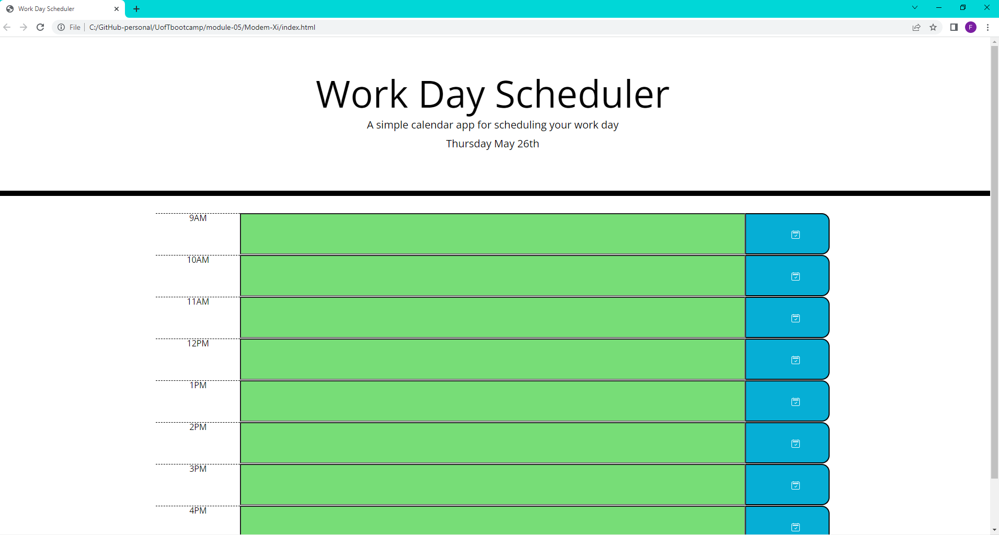

# Fundemental JavaScrit Quiz

## Description
The following web application generates a basic day planer for use during office hours of 9am-5pm. With the use of bootstrap the application is dynamic and adjusts to screen sizing.
The use of javascript is lightweight and impactful through the use of APIs such as Jquery and momentsjs. 
With this project i plan on working to add aditional features such as the ability to flip through days and save them to local storage.
This would create a more useful realworld application, this is but a step to the final destination. 

 

## Mock Up and screenshots

Below you will see a screen shot of the deployed web app.

## Technology

This project utilizes the following technologies:
momentsjs
Jquery
bootstrap

## Installation

  The website can be viewed through GitHub pages [here](https://ydennekrf.github.io/Modem-Xi/)
